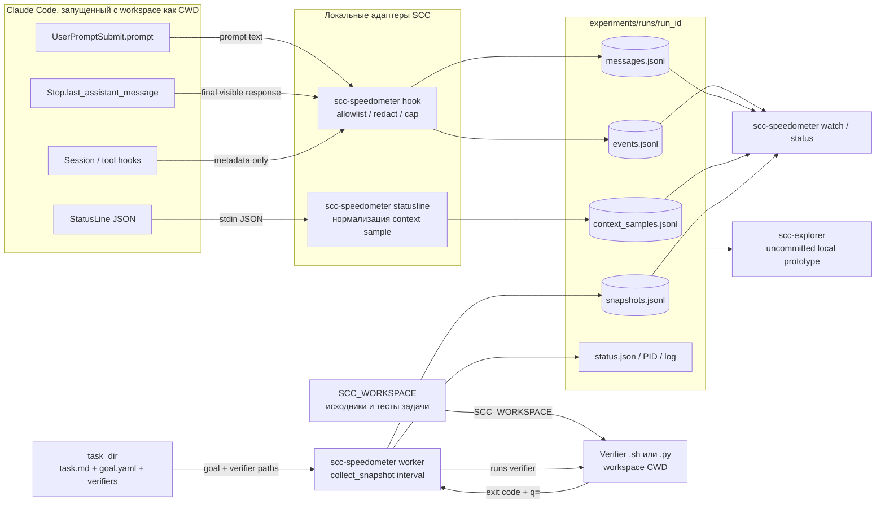
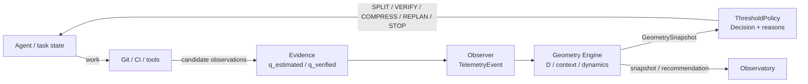

# SCC: карта текущей архитектуры

> **Срез:** 2026-09-30. Это карта текущего кода, сопоставленная с архитектурными документами. Раздел «Целевая архитектура» помечает замысел, который ещё не соединён в runtime. Живая точка входа продукта — локальный verifier-backed Speedometer. В текущем рабочем дереве есть незакоммиченный прототип Explorer; он не входит в branch `3009_1_scc_test`, куда запрашивалось положить эту схему.

## 1. Короткий вывод

SCC проектируется как геометрический supervisory controller для долгих задач LLM-агента: наблюдения и доказательства должны обновлять оценку состояния, геометрический слой — вычислять положение относительно целевой области, controller — предлагать действие, а Observatory — показывать состояние человеку.

**Реальный live-путь пока уже и односторонний:** Claude Code hooks + StatusLine + task verifiers → локальные JSONL/snapshots → terminal viewers. Speedometer измеряет verifier-backed completion и показывает контекстные наблюдения, но **не вызывает `ThresholdPolicy` и не отправляет SPLIT/COMPRESS/ROLLBACK/STOP обратно агенту**. Geometry, Evidence и Controller реализованы как самостоятельные библиотеки, а не единый работающий контур.

## 2. Два уровня архитектуры

### 2.1 Текущий runtime: локальное измерение



**Как читать:** `messages.jsonl`, `events.jsonl` и `context_samples.jsonl` — наблюдения; только `q_i` из verifier results меняют weighted progress и `D_completion`. Стрелки не означают, что вся телеметрия влияет на доказательство прогресса.

### 2.2 Задуманная supervisory-архитектура: пока не интегрирована



Это соответствует `docs/02_architecture/overview.md` и исследовательскому замыслу. **Ни `speedometer.py`, ни `watch` сегодня не вызывают этот цикл.** В активном Speedometer runtime есть отдельный короткий расчёт completion distance/progress, но не сбор полного `GeometrySnapshot` и не применение policy.

## 3. Компоненты и реальные границы

| Слой | Код | Ответственность | Подключённость |
|---|---|---|---|
| Доменные типы | `src/scc/models.py` | `Goal`, `Requirement`, `Distance(completion,cost,uncertainty)`, `ContextBreakdown`, `ContextNode`, `Evidence`. Цель — область: hard constraints + `q_min`. | Типы существуют; это не полноценная хранимая версия состояния или JSONL schema. |
| Конфигурация | `config/default.yaml`; `src/scc/config.py` | `load_config()` читает стартовые `cost_weights`, `evidence_weights`, controller thresholds и Speedometer limits. | Используется кодом; коэффициенты помечены как стартовые, требуют калибровки. |
| Observer / Speedometer | `src/scc/observer/speedometer.py` | CLI, prepare, start/worker, `_load_goal`, `_check_verifier`, `collect_snapshot`, status/stop/watch, hooks/statusline install/uninstall. | Основной работающий продуктовый контур. Это observer, не контроллер агента. |
| Claude Code hooks | `src/scc/observer/claude_code_hooks.py`; `events.py` | `normalize_hook_payload`, `append_hook_event`, `append_hook_message`. Allowlist поддержанных событий; отдельно сохраняются prompt и Stop final response. | Подключается workspace-local командами. Скрытый prompt, reasoning, tool payloads и содержимое файлов не принимаются. |
| StatusLine | `src/scc/observer/statusline.py` | `normalize_statusline_payload`, `append_statusline_sample`, `format_statusline`. | Отдельный input о context window; не выводится из hook payload. |
| Общая телеметрия | `src/scc/observer/telemetry.py`; `events.py` | `TelemetryEvent`, `TelemetryLog.record()` — память и optional append-only JSONL. | Общий utility API; Speedometer использует специализированные adapters/JSONL потоки. |
| Geometry | `src/scc/geometry/` | `distance.py`: `progress`, `completion_distance`, `weighted_distance`, `goal_reached`, `cost_to_go`; `context.py`: density/friction/entropy; `dynamics.py`: velocity/acceleration/efficiency/inflation/alignment; `mass.py`, `fragmentation.py`, `prompt_quality.py`. | Много отдельных формул реализовано. Live worker использует только часть completion/progress и prompt heuristic, а не полный набор метрик. |
| Evidence | `src/scc/evidence/update.py`; `git_source.py` | `apply_evidence()` доверительно-взвешивает observed q; `estimation_gap()` сравнивает estimated и verified distance. Optional `read_commits()` требует extra GitPython. | Библиотечный слой. PR/CI mapping обозначен TODO; live Speedometer snapshots идут из task verifiers. |
| Controller | `src/scc/controller/actions.py`; `policy.py` | `Action`, `GeometrySnapshot`, `Decision`, `ThresholdPolicy.decide()` с приоритетами STOP/ROLLBACK/VERIFY/RETRIEVE/COMPRESS/REPLAN/MERGE/SPLIT/CONTINUE. | Политика работает изолированно; downstream actuator/agent connection отсутствует. |
| Observatory node card | `src/scc/observatory/render.py` | `render_node_card(ContextNode, ...)` — текстовая карточка контекстного узла. | Не live Speedometer UI и не web dashboard. |
| Speedometer TUI | `src/scc/observer/speedometer.py` | `watch` показывает verifier progress, context sample, prompt completeness, event/message feeds. | Live terminal view; при TTY обновляет экран, без TTY печатает один render. |
| Local Run Explorer | Текущий локальный рабочий tree: `src/scc/log_explorer/`; добавлен локальный `pyproject.toml` entry point `scc-explorer` | `reader.py` — безопасное чтение allowlisted run files; `query.py` — AND-поиск/selectors; `catalog.py` — discovery/filter/page; `ui.py` — curses run list/timeline/detail; `cli.py` — `--list` или TUI. | Прототип присутствует только в незакоммиченном локальном дереве и **не включён в target branch `3009_1_scc_test`**. Docs ещё говорят «предложение»; dedicated `tests/log_explorer/` нет. Не считать shipped/validated в ветке. |

## 4. CLI и операции

В committed target branch `pyproject.toml` регистрирует `scc-speedometer`. В текущем локальном незакоммиченном дереве добавлен также `scc-explorer`; эта регистрация не входит в запрос на push схемы.

### Speedometer

| Команда | Что делает |
|---|---|
| `scc-speedometer prepare --run-id ID --task-dir PATH` | Создаёт пустой task workspace, копирует `context/CLAUDE.md`, создаёт root import. Подготовка сейчас Snake-specific. |
| `scc-speedometer start --run-id ID --task-dir PATH [--background]` | Проверяет workspace/goal, пишет config и запускает foreground worker или background `_worker`. |
| `scc-speedometer status --run-id ID` | Читает PID/status/latest snapshot, показывает observer state и progress summary. |
| `scc-speedometer stop --run-id ID` | Посылает SIGTERM **background observer worker**; не завершает Claude Code и не обозначает outcome задачи. |
| `scc-speedometer watch --run-id ID` | Отдельный 1-секундный screen renderer; `Ctrl-C` отсоединяет display. Это не worker и не run itself. |
| `scc-speedometer hooks install/uninstall` | Добавляет/удаляет только SCC-managed hooks в workspace-local settings, сохраняет посторонние настройки. |
| `scc-speedometer statusline install/uninstall` | Устанавливает/удаляет context sampler; отказывается молча заменять существующий StatusLine. |
| `scc-explorer --list [--runs-dir PATH]` | Печатает короткий список локальных runs; `scc-explorer` без `--list` требует TTY и открывает read-only curses UI. |

### Статус наблюдателя ≠ статус задачи

В `speedometer.py` `_pid_state()` различает `running`, `stopped`, `not-started`, `stale`; task lifecycle не выводится из observer stop. Explorer парсит lifecycle только по имеющимся явным session markers; при недостатке evidence он остаётся `unknown`.

## 5. Формула verifier-backed progress

Для каждой goal requirement worker запускает указанную `.sh`/`.py` команду в workspace с `SCC_WORKSPACE`. Успех требует валидного `q=<0..1>` и exit 0; иначе q=0 и записывается статус ошибки.

```text
Progress = Σ(wᵢ · qᵢ) / Σwᵢ
D_completion = 1 − Progress
G_reached = all(hardᵢ ⇒ qᵢ=1) ∧ Progress ≥ q_min
```

Промпт, final answer, hook count, context sample и commit не меняют `q_i`. `Q_prompt` — отдельная четырёхпунктовая RU/EN keyword heuristic, не semantic judge. Live snapshot пишет `uncertainty: null`; `D_cost`/`U_D` ещё не валидированы в этом data path.

## 6. Run storage и граница приватности

`experiments/runs/<run_id>/` содержит `config.json`, `status.json`, `speedometer.pid.json`, `speedometer.log`, `events.jsonl`, `messages.jsonl`, `context_samples.jsonl`, `snapshots.jsonl`.

- `config.json` сохраняет task_dir/workspace/start time, **не** неизменяемый goal/verifier hash.
- `collect_snapshot()` заново читает `<task_dir>/goal.yaml` на каждом snapshot и выбирает verifier из каждого requirement.
- Изменение goal/verifiers в ходе run способно смешать старые и новые acceptance evidence; для нового контракта нужен отдельный task version + новый run ID.
- Текст локален, redacted до записи, capped по размеру, truncated marker добавляется; hidden instructions/reasoning/tool payloads/file contents не сохраняются.
- JSONL write append-only; `scc-explorer` читает local run files через allowlist и не должен обходить workspace.

## 7. Операционная осторожность

Статусы и progress относятся к конкретному run и должны запрашиваться из корня SCC: `RUNS_DIR` в Speedometer относителен к текущему каталогу. Не помещать snapshot values в постоянную архитектурную документацию — это наблюдения, которые меняются по мере работы.

Revised Snake goal находится в `experiments/tasks/snake-v2/` как отдельная версия для нового run. Исходный `experiments/tasks/snake/` и уже собранные snapshots остаются неизменными.

## 8. Где искать политику, теорию и статус

- `docs/00_vision.md`, `docs/01_theory/` — теория state-space, goal region, distance, dynamics/context laws.
- `docs/02_architecture/overview.md` и component docs — целевой design, который надо читать вместе с текущей картой.
- `docs/02_architecture/local_run_explorer*.md` — спецификация Explorer; её заявленный status устарел относительно CLI/source code.
- `docs/03_experiments/experiment_plan.md` — общая программа E1–E5; MVP observer не подтверждает научные гипотезы.
- `MVP/` — проверенный scope и privacy/measurement protocol Speedometer.
- `experiments/tasks/` — task/goal/verifier contracts; `experiments/runs/` — локальные observer runs; `demos/snake/` — reference implementation, отличная от чистого measured workspace.
- `tests/` — geometry/evidence/controller, prompt heuristic, hooks/statusline/speedometer lifecycle; dedicated Log Explorer suite отсутствует.

## 9. Главное архитектурное расхождение

Архитектурный overview рисует замкнутую обратную связь Agent → Evidence → Geometry → Controller → Agent. Проверенный production-like local path на сегодня другой: **Observation → verifier qᵢ → snapshot → human-facing view**. Это архитектурный разрыв, а не скрытая автоматизация. Geometry, evidence updater и threshold policy пока не управляют агентом.